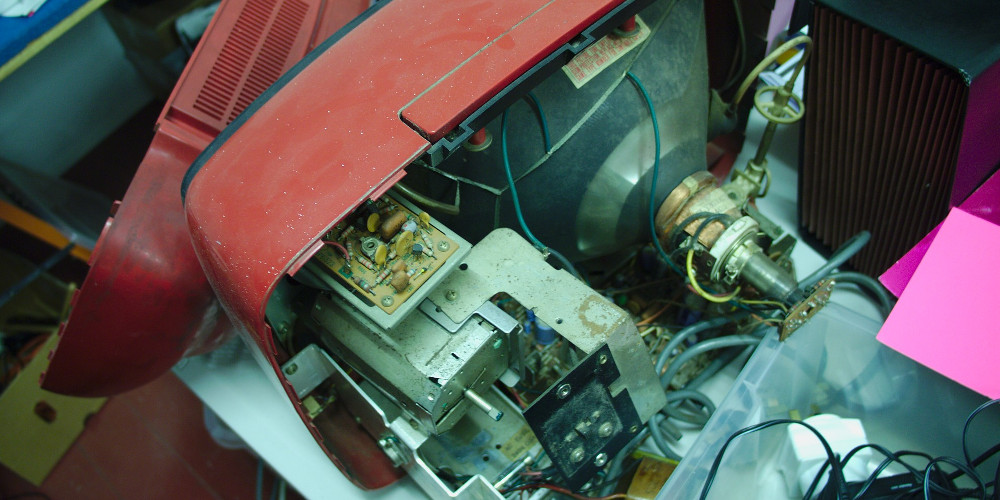

As a kid I used to get this sensation on sunny days that somewhere unbeknownst to me someone was having the time of their life and I was missing out. The motivation for this project is the sensation that somewhere in the world something weird or wonderful or mundane is happening at any instant.This project is an attempt to capture those fleeting moments, from the new archive of human existance, YouTube.

I've been holding on to a few old analogue TV's for a while in the hope of bringing them to life, and finally I've found a reason. Here's a picture of one of them dismantled in my studio: .

However, before I move onto the hardware component of this project, I need to have a proof of concept of the software needed to drive this piece. A while ago when I first came in contact with the Raspberry Pi I was curious about You Tube playback on the device and after searching a little I came across this command-line utility called [yt](https://github.com/rjw57/yt "yt YouTube client"). It was interesting because not only did it have a Raspberry Pi video player back end (using the threaded and hardware accelerated [OMX Player](https://github.com/rjw57/yt)) but when I ran it I noticed that the YouTube videos it played had no user interface or other decorations whatsoever. There's so much distracting text over YouTube videos these days, either advertising or channel recommendations or what-have-you, that this seemed really refreshing. It altered the whole YouTube experience considerably.

Digging into the *yt* software, I realised that it depended on another piece of open source software called [Youtube-dl](http://rg3.github.io/youtube-dl/ "Download videos from YouTube.com") that was a ubiquitous utility that could download YouTube clips to a file. What's more, if you passed a certain command line option to it, it would return a URL that other software, such as a video player, could use it to directly stream the video. So running the following command in a terminal:

```
youtube-dl -g "http://www.youtube.com/watch?v=vwji6HiXWCs^C"
```
would result in:
```
https://r3---sn-ppoxu-hxae.googlevideo.com/videoplayback?ip=58.6.238.113&key=yt5&ipbits=0&ratebypass=yes&source=youtube&ms=au&fexp=937417%2C913434%2C936910%2C936913%2C934022&mt=1395842218&sparams=id%2Cip%2Cipbits%2Citag%2Cratebypass%2Crequiressl%2Csource%2Cupn%2Cexpire&mv=m&id=o-AMcoK724IgM4sOpnyUHzTfUyiG9Yicyo5xFWMvdN_eTq&expire=1395863465&upn=QH5G1njuLwo&signature=685178616E7AE29F46BE93AF88E5EB1F93514FB8.7542817642EF7A54AE172275151FED39F3D87428&itag=22&requiressl=yes&sver=3
```
This extremely long URL is in fact a link to a plain streamable video with no branding or other overlays. You could watch this video by pasting that link into your browser, or by piping it into a video player, e.g. [vlc](https://github.com/videolan/vlc)

Even more searching on this topic lead me to [Minitube](http://flavio.tordini.org/minitube "Minitube") which put all of the above to fantastic use in a really nice package.

So when I thought of the idea of creating a random YouTube video installation for the DevArt commission, I turned to these open source projects for inspiration and technical guidance. The *youtube-dl* utility is written in Python, so I initially thought of developing the whole project in Python. I have some Python skills but ultimately it would take me longer as my toolkits of choice these days for creative coding are [Processing](www.processing.org) and [openFrameworks](www.openframeworks.cc). I did consider it briefly, but then I realised I could call the *youtube-dl* program from within an openFrameworks app and pipe the output back in to be read by an ofVideoPlayer object.

Hence, I'm developing the software for this project in OF. I'll be making a version for both the desktop and the Raspberry Pi. What I plan to achieve is this:

- Write an app that can load and display a series of neverending undecorated YouTube clips
- Make sure the loading of new videos doesn't does any delays or halt execution of the program, i.e. it is threaded
- Make sure each new video is random
- Give the user an option to move to the next clip if they get bored with the current one. In the installation version, the 'wheel of fortune' wheel (see the project summary for more details) will take care of this. At this prototype stage, forgive me but I'll settle with just hitting the spacebar.


