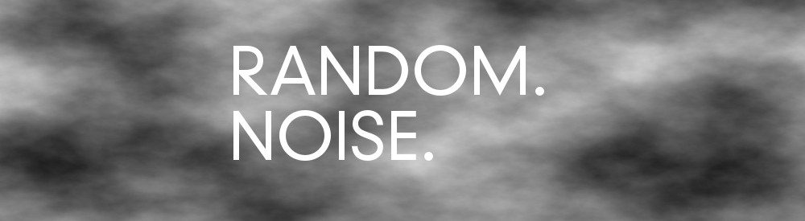

.

The next missing link in the development of this project - randomising a YouTube video clip? Easy! Or at least so I thought.

**Pseudo Random Numbers**

As randomness is such an important part of this project, I had to get this right. As any developer knows, computer generated random numbers are typically not "random", in fact they are "pseudorandom", which means they appear random to the uninformed gaze, but really they are deterministic, which means there's a known process that's generating them leaving them slightly less than random. In [C++11](http://en.wikipedia.org/wiki/C++11) the most recent version of the C++ programming language, you can actually use a whole swag of different random number generators, including a purportedly "true" random number generator, mysteriously called *random_device*. Another random generator with a cool name is the so called "Mersenne Twister", which is actually the default pseudo random generator for a bunch of programming languages (excluding C and C++ prior to C++11 however). For more details see http://www.cplusplus.com/reference/random/.


**YouTube API**

Having said all of this, I sheepishly admit that for the moment I am still relying on the standard C++ random number generator that openFrameworks utilises. It's a prototype and I'll refine this further later.
Moving onto the YouTube API that I would need to use to retrieve a video clip, I had a search around and then settled on the version 2 of the YouTube API. While this version will actually be deprecated as of the 14th of March 2014, it seemed the mostly widely used in the examples I came across, and the Version 3 API apparently required me to register my application with Google so that it could then submit API requests. I didn't feel like going through that process, so I opted for [Version 2](https://developers.google.com/youtube/2.0/developers_guide_protocol#Retrieving_and_searching_for_videos "YouTube v2 API")

Once I got to browsing the YouTube API, I realised in horror that there was no easy way to randomise a YouTube clip. So I searched the web again, looking for examples of people attempting this, and indeed, it had been done before. The knowledge that this sort of thing was possible came to me from projects such as the following: [http://www.youtuberandomvideo.com](http://www.youtuberandomvideo.com/ "Random YouTube videos"). Knowing that it was possible, I dug deeper, finally coming across this [Stack Overflow question](http://stackoverflow.com/questions/11315416/how-do-i-get-a-random-youtube-video-with-the-youtube-api). The answer was a little disheartening - that it wasn't possible, however there did appear to be some workarounds to get something resembling random. The first suggestion was to build a huge database of youtube URLs and then randomise the retrieval of them yourself (this seemed laborious and too brute force for my liking). The second was to exploit a quirk in the YouTube api where if you create a search query like the following:
```
https://gdata.youtube.com/feeds/api/videos?q="v=XXXX"
```
and you randomise those first 4 characters represented by the 'X's, then you'll get back a "random" video that has those first 4 characters as part of its URL. This is what I've done to generate videos at this point. I'd be happy to hear what the Google engineers might suggest as an alternative here.