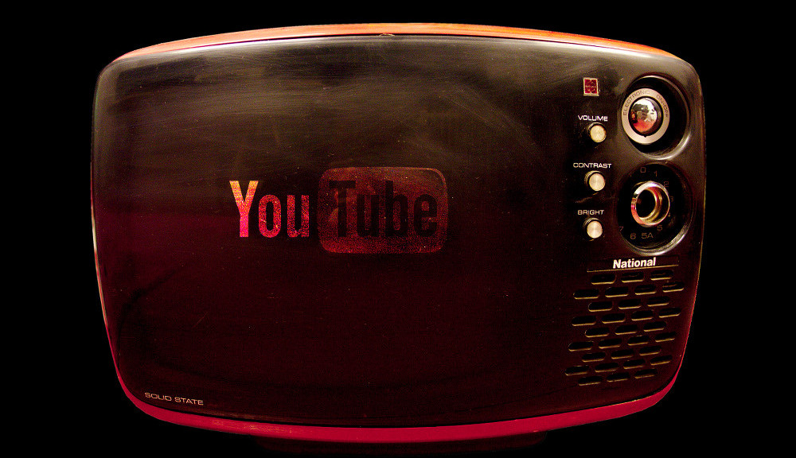

.

In order to create a proof of concept, I went ahead and transformed an old retro solid state TV into a random YouTube channel, complete with vertical-hold and grainy image...the real deal, not a photoshop filter!

This particular TV was a little problematic because the V-Hold knob was kind of broken, so apologies for the occasional bad image. The audio sounded great though, in REAL authentic mono. I found this TV on the street, I saw it initially then when I came back for it someone had cut the power cord (a pet peeve of mine), but with a bit of open case surgery I fixed it. I'm connecting the composite video to RF converter to the outside of the box (the aerial input in fact), however it would be easy enough to bundle all the tech into the case so that from the outside it looked like a *perfectly normal TV*, thanks to the miniature size of the Raspberry Pi. 

Here's the link to a video of my progress:
[http://www.youtube.com/watch?v=1asTuPacSTg](http://www.youtube.com/watch?v=1asTuPacSTg)

