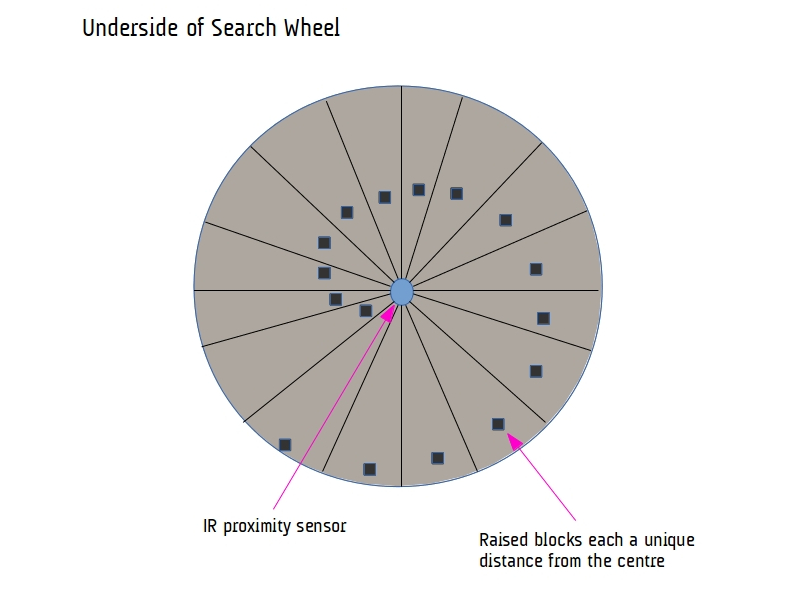
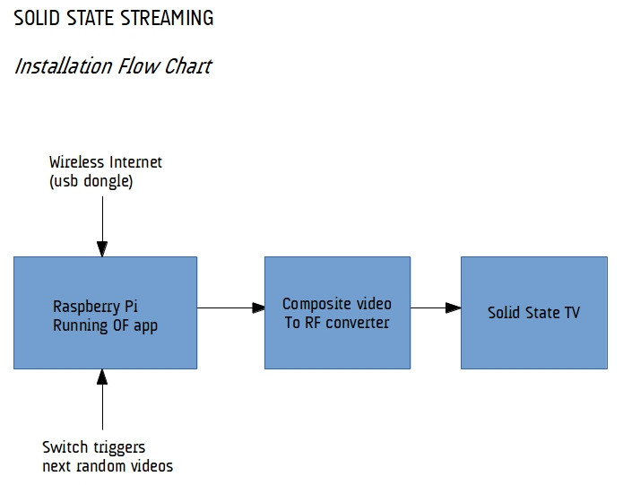

As previously mentioned in the project summary there are two components to the exhibition of this piece. Firstly, a standalone retro TV that play random YouTube clips (called Solid State Streaming) and the principal work, TeleRoulette, which is a video wall connected to a search wheel which can be used to randomise content for the display.

Here's a schematic of the main TeleRoulette installation. The search wheel consists of a spinnable wheel divided into segments that are labelled with a word. If a segment lines up with the arrow on the disc at the end of a spin, that word is chosen as a search term in a YouTube query. If the word is labelled "random", the search returns a random video. The selected video is then streamed onto the video wall.

The way in which the search wheel works is as follows - underneath the wheel is a spiral of small blocks which serve as obstructions for an infra-red proximity sensor. The sensor detects the distance of the current block it's pointed at, which enables it to have an understanding of what word has been selected when the wheel comes to rest. An Arduino connected to this sensor then communicates which word has been selected by sending serial data via an RF connection (XBee) to the main installation PC. The openFrameworks app running on the PC then kicks of the corresponding YouTube search, either randomising a video based on a category or just fetching a completely random movie.

To clarify the processes involved in both these installations, I've made up some flow charts of the processes involved in each:

